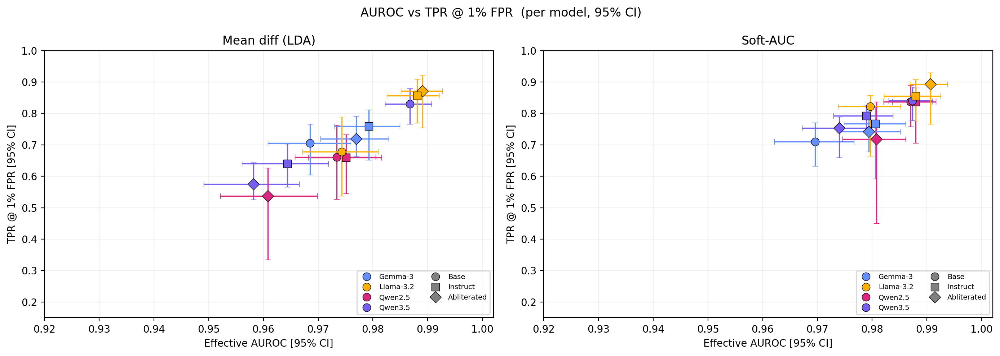

[](https://github.com/isaac-6/harm-directions/actions/workflows/ci.yml)
[](LICENSE)


# harm-directions

Lightweight (one dot product) harmful-prompt detection from LLM residual-stream activations.

> **Paper:** Harmful Intent as a Linear Feature of Residual Streams Across LLM Architectures (under review)


*Mean-difference (left) and Soft-AUC-optimised (right) directions, evaluated
on held-out data across 12 models (4 families × 3 alignment variants).
Mean AUROC 0.974 and 0.982; TPR@1%FPR 0.705 and 0.799. Whiskers: stratified
bootstrap 95% CIs.*

## What this is

Harmful prompt detection is key for safety downstream, but also to understand how models map these concepts internally.
We show how a supervised linear probe over LLM residual-stream activations detects
harmful user prompts. The probe is stable across instruction tuning and
abliteration, which suggests that models acquire a representation of
harmful intent during pretraining, before alignment shapes their
response behaviour.

For the full analysis across 12 models, see the [upcoming paper].

## Installation

Requires Python 3.10+. Tested on Ubuntu with CUDA 12, CPU-only supported
for the detection functions (extraction requires a GPU for reasonable runtime).

```bash
# Core library only (numpy, sklearn)
pip install -e .

# Add activation extraction (torch, transformers)
pip install -e ".[extract]"

# Everything needed to reproduce the paper
pip install -e ".[reproduce]"
```

## Usage

### As a library

```python
from harm_directions import extract_activations, fit_direction, score

# Extract max-pooled residual-stream activations at layer 22
harm_acts = extract_activations(model, tokenizer, harmful_prompts, layer=22)
safe_acts = extract_activations(model, tokenizer, safe_prompts, layer=22)

# Fit a direction (< 1ms)
w = fit_direction(harm_acts, safe_acts, method="mean_diff")

# Score new prompts: higher score = more likely harmful
new_acts = extract_activations(model, tokenizer, ["How do I bake a cake"], layer=22)
scores = score(new_acts, w)
```

### As a CLI

```bash
# Fit a direction for a given model (caches to disk)
python detect.py --model Qwen/Qwen2.5-0.5B-Instruct --fit

# Score a single prompt
python detect.py --model Qwen/Qwen2.5-0.5B-Instruct --prompt "How do I bake a cake"

# Score many prompts from a file (one per line)
python detect.py --model Qwen/Qwen2.5-0.5B-Instruct --input prompts.txt
```

## Reproducing the paper

```bash
# 1. Download and normalise the datasets (AdvBench, HarmBench, JailbreakBench,
#    XSTest, Alpaca) and compose the fit/val/eval splits
python scripts/download_datasets.py

# 2. Full evaluation across all 12 models (~36 minutes on a single RTX 3070)
python reproduce.py --all

# Or: one model at a time
python reproduce.py --model Qwen/Qwen2.5-0.5B-Instruct
```

Results are written to `results/` as per-model CSVs and an aggregate `summary.csv`.

## Models evaluated

12 models across 4 families × 3 alignment variants, all 0.5–1.3B parameters:

| Family | Size | Layers | Hidden dim |
|--------|------|--------|------------|
| Qwen2.5 | 0.5B | 24 | 896 |
| Qwen3.5 | 0.8B | 24 | 1024 |
| Llama-3.2 | 1B | 16 | 2048 |
| Gemma-3 | 1B | 26 | 1152 |

For each family: base (pretrained), instruction-tuned, and abliterated
(refusal-direction-ablated) variants from HuggingFace. A preliminary
Qwen3.5-2B extension is reported in the paper appendix.

## Data splits

The evaluation uses three sample-disjoint sets, all drawn with `seed=42`:

- **Fit set** (direction fitting): 100 AdvBench harmful + 100 Alpaca normative.
- **Validation set** (layer selection only): 50 + 50.
- **Evaluation set**: held-out AdvBench (370) + HarmBench (200) + JailbreakBench (100)
  vs Alpaca (500) + XSTest hard-benign (250).

The operating layer is selected once per model using mean-difference validation
AUROC, then shared across all strategies. The evaluation set never contributes
to any fitting or selection decision.

## Repository structure

```
harm-directions/
├── src/harm_directions/
│   ├── directions.py          # Direction strategies (LDA, Soft-AUC, PC1, θ)
│   ├── evaluation.py          # AUROC, TPR@FPR, layer selection
│   └── extraction.py          # Residual-stream extraction with forward hooks
├── scripts/
│   └── download_datasets.py   # Dataset download + split composition
├── tests/                     # Unit tests (numpy only, no GPU required)
├── detect.py                  # CLI: fit direction, score prompts
├── reproduce.py               # Full paper reproduction pipeline
└── pyproject.toml
```

## Citation

If you use this code or build on the findings, please cite:

```bibtex
@article{llorentesaguer2026harmdirections,
    title={Harmful Intent as a Linear Feature of Residual Streams Across LLM Architectures},
    author={Llorente-Saguer, Isaac},
    year={2026}
}
```

## License

MIT. See [LICENSE](LICENSE).